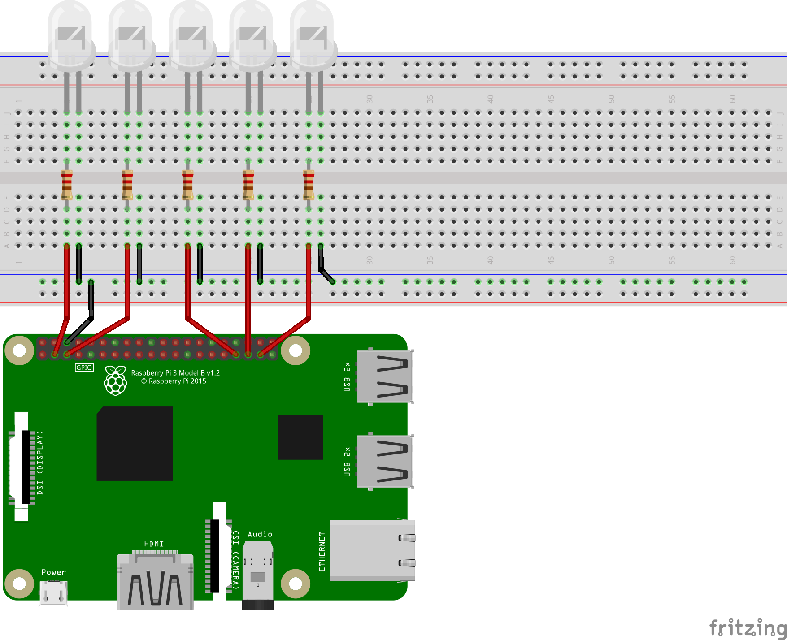

# Xmas blinking lights

Kotlin everywhere - now also in my christmas village providing light for the little elf inhabitants.

## Circuit

This schema shows the circuit I've used. I'm not sure about the resistors, though!



## Install libs on RaspberryPi

## pigpio

https://github.com/joan2937/pigpio

Connect to your pi with SSH:

```sh
$ git clone https://github.com/joan2937/pigpio
$ cd pigpio
$ make
$ sudo make install
```

## Build

Run `gradle build` and transfer the resulting .kexe binary to the RaspberryPi.
